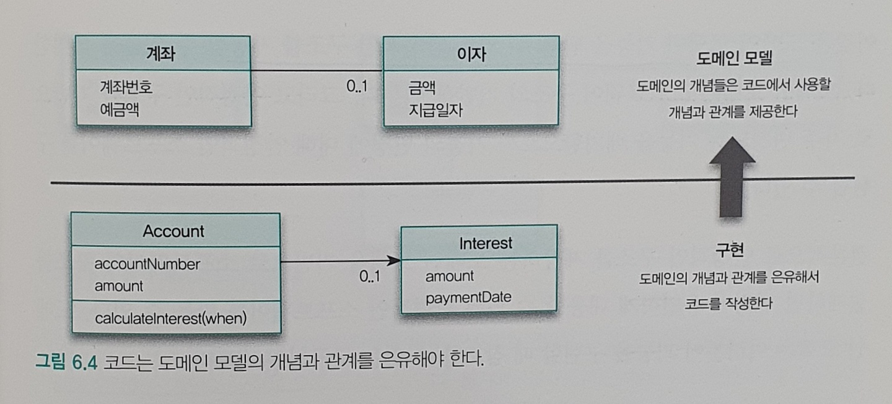
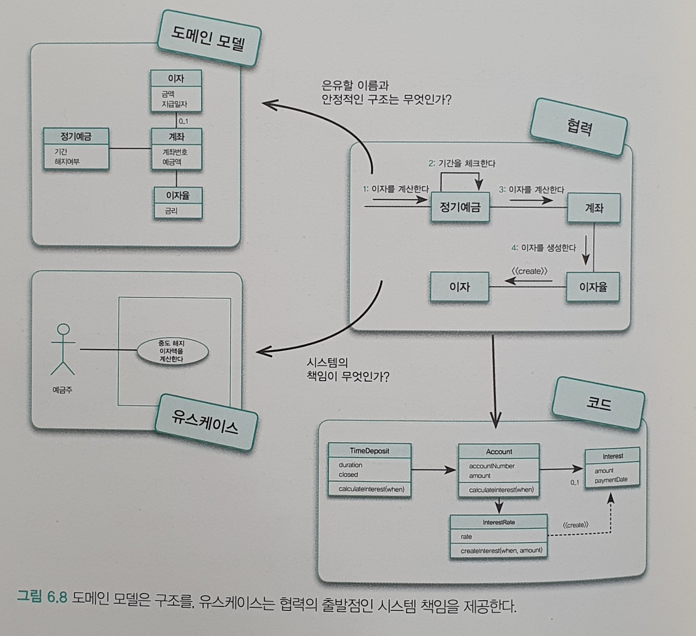

# 객체 지도

* 변경에 대비하려면 자주 변경되는 `기능`이 아니라 안정적인 `구조`를 중심으로 설계해야 한다.
* 객체지향은 시스템 기능을 객체의 책임으로 분배해서 객체 구조에 집중하고 기능이 객체의 구조를 따르게 한다.
* 기능이 책임으로 분할되고 적절한 객체에게 분배되므로 기능이 변경되어도 객체 간 구조는 유지된다.

## 구조

사용자나 이해 관계자가 도메인에 대해 생각하는 개념과 개념들 간의 관계를 표현한다. 이를 도메인 모델링이라고 한다.

### 도메인

* 프로그램을 사용하는 대상 분야
  * 시간을 보내기 위해 게임 소프트웨어 사용
  * 자산을 관리하기 위해 인터넷 뱅킹 사용

### 모델

* 대상을 단순화해서 표현한 것
* 필요한 것만 추상화, 단순화해서 재구성한 것

### 도메인 모델

* 소프트웨어의 목적에 따라 개념 간의 관계, 규칙, 제약을 추상화한 것
* 사용자 모델, 디자인 모델, 시스템 이미지를 포괄한 추상화된 소프트웨어 모델

#### 사용자 모델

* 사용자가 제품에 대해 가지고 있는 개념의 모습

#### 디자인 모델

* 설계자가 마음 속에 갖고 있는 시스템 모습

#### 시스템 이미지

* 최종 제품

설계자는 디자인 모델 기반으로 만든 시스템 이미지가 사용자 모델을 정확하게 반영하도록 노력해야 한다.

### 표현적 차이

소프트웨어 객체는 현실 객체의 추상화나 모방이 아니라 `은유`를 기반으로 `재창조`한 것이다. 은유를 통해 현실과 소프트웨어 사이의 차이를 최대한 줄여야 한다.

소프트웨어 객체를 창조하려면 도메인 모델을 은유해야 한다. 도메인 모델을 기반으로 설계하고 구현하면 표현적 차이를 줄이고 사용자의 관점을 코드에 반영할 수 있다.

코드의 구조가 도메인의 구조를 반영하므로 도메인을 이해하면 코드를 이해하기 쉬워진다.

### 안정적인 구조

도메인 모델의 핵심은 사용자가 도메인을 바라보는 관점을 반영해 설계하고 구현하는 것이다. 사용자가 가장 도메인의 본질을 잘 이해하고 있기 때문에 사용자 모델을 반영했을 때 소프트웨어 변경이 적어진다. 따라서 도메인 모델을 사용하면 안정적인 구조를 설계할 수 있다.

예를 들어, 정기 예금과 이자율로 도메인 모델을 만들면 정의가 바뀌지 않는 이상 쉽게 바뀌지 않는다. 예금과 이자율의 관계처럼 개념 간의 관계는 중요한 비즈니스 규칙과 정책을 반영하고 있으며 도메인 모델은 이를 통해 안정적인 구조를 제공한다.

## 기능

실제 사용자에게 중요한 것은 도메인 모델이 아니라 소프트웨어의 기능이다. 이 기능을 기술하기 위해 유스케이스 기법을 사용한다.

### 유스케이스

* 사용자의 목표를 달성하기 위해 사용자와 시스템 사이의 상호 작용을 정리한 것
* 상호 작용의 흐름, 이야기를 나타내는 것이 중요하다.
* 시스템 행위에 초점을 맞추고 사용자 인터페이스를 어떻게 구성할지에 대한 세부 정보는 제외한다.
* 객체의 구조나 책임 등 내부 설계 정보는 포함하지 않는다.

유스케이스는 피처 목록과는 다르다. 피처는 기능의 단순한 나열이기 때문에 피처를 독립적으로 보이게 한다. 유스케이스는 시스템과 상호작용 하는 문맥을 통해 연관된 기능을 묶을 수 있다.

## 기능과 구조의 통합

* 유스케이스는 제공할 기능을 시스템의 책임으로 표현해 객체 구조에 책임을 분배할 출발점이 된다.
* 도메인 모델은 기능을 은유할 안정적인 구조를 제공한다.

협력 그림의 도메인 모델을 보면 시스템 책임을 객체로 분할하고 책임을 할당했다. 각 객체는 스스로 상태와 행위를 관리하는 자율적인 존재로 설명되며, 서로 협력하고있다.

이 도메인 모델을 토대로 속성은 클래스의 변수, 책임을 메서드로 변환한 것이 코드 그림의 클래스 다이어그램이다.

객체의 이름은 도메인 모델에 있는 개념에서 나온다. 책임은 그 개념에 부합하도록 할당한다. 예를 들어, 이자율은 이자를 계산하는 책임을 가진 객체다.

## 도메인 모델이 안정적인 이유

* 도메인 모델에 있는 개념은 비즈니스가 없어지거나 개편되는 게 아니면 계속 유지 되는 개념이다.
* 도메인 모델의 개념 간 관계는 비즈니스 규칙을 기반으로 하므로 그 정책이 변경되지 않으면 유지된다.
* 변경 사항이 생겨도 책임과 객체 간의 대응 관계만 수정된다.

만약 기존에 단리 이자만 지급하다가 복리를 추가해야 한다면, 추상 클래스 `InterestRate`를 상속하는 단리 이자 클래스와 복리 이자 클래스를 생성하면 된다. 그리고 `InterestRate`에 정의된 `createInterest()` 메시지를 수신할 경우 수신하는 객체의 타입에 따라 단리와 복리를 선택한다. 이렇게 구현하면 클래스 간의 관계는 그대로 유지되고 기능만 추가된다.

### 연결 완전성

* 도메인 모델링에서 사용한 객체와 개념을 프로그래밍 설계에서도 매끄럽게 변환할 수 있는 객체 지향의 특성

### 가역성\(reversibility\)

* 코드의 변경으로 도메인 모델의 변경 사항을 유추할 수 있는 객체 지향의 특성

