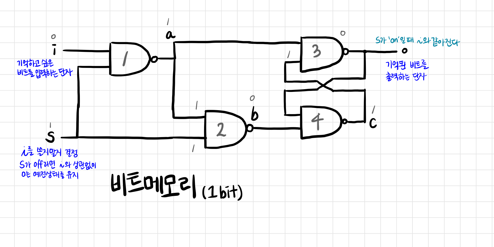

# 그래서 컴퓨터는 어떻게 동작하나요? Ch 1 ~ 10 \(~48p\)

> 저자 : J.클라스 스코트 지음   
>  1월 5주차 기록 \(읽은 날짜 1월 26일-1월 28일\)

## 1. 원리를 알면 쉽다

* 원리를 모르면 복잡하게 작동한다고 생각하겠지만, 원리를 알면 훨씬 단순 명쾌해진다.

## 2. 누구를 위한 책인가

* 모두를 위한 책, 핵심만 전달한다.

## 3. 컴퓨터의 속도와 능력

* 컴퓨터는 알고 보면 간단한 작업밖에 못하는 극도로 단순한 기계일 뿐이다. 다만 단순한 작업을 눈 깜짝할 사이에 수억 번이나 할 수 있다. 단순한 작업 몇 가지를 조합해서 복잡한 일을 할 수 있다.
* 단순한 컴퓨터가 만능이 된 이유는 작업을 처리하는 **속도** 때문이다.
* 컴퓨터는 전기로 작동하므로 속도 또한 전기가 움직이는 속도를 따른다.
* 1940년대 컴퓨터가 세상에 처음 나왔을 때보다 더 빨라지고 작아지고 저렴해졌음에도 하는 일은 변한 게 없다.

## 4. 컴퓨터 용어

* 자주 사용하는 컴퓨터 용어는 꽤 간단한 편이다.

## 5. 비트

* `비트(bit)` : 공간 위에서 특정한 크기로 특정한 위치를 차지하는 물리적 사물, 한 가지 상태로 계속 머무를 수도 있고 두 가지 상태를 번갈아 가며 바꿀 수 있음
* 비트는 빛과 유사하다. 전류가 흐르거나 흐르지 않는 장소이다.
* 전보는 1840년대 발명되었고 1비트밖에 주고받지 못했지만 역사적으로 매우 중요한 발명이다.

## 6. 게이트

* 컴퓨터 게이트는 입력 비트 2개를 조사해서 세 번째 비트를 생성한다.

## 7. 게이트 변형하기

* NAND 게이트가 어떻게 작동하는지만 이해하면 컴퓨터를 이해할 수 있다.
* NAND 게이트는 가장 작은 부품이고 이것들이 모여 컴퓨터가 된다.

## 8. 다이어그램

* 평범한 기계 장치와 다르게 집적 회로 구조는 복잡하므로 눈으로 볼 수 없어 직관적으로 이해하는 것은 불가능하다.
* 다이어그램을 사용하여 배우자. 다이어그램 해독 능력을 기르면 컴퓨터를 이해하는 데 도움이 된다.
* 다이어그램 안에는 두 가지 속성밖에 없다. 하나는 입력 또는 출력을 가진 부품이고, 다른 하나는 입력과 출력을 서로 연결하는 전선이다.

## 9. 비트 메모리

* s가 `ON`일 때 o는 i와 같아진다.
* s가 `OFF`일 때 o는 i와 상관없이 이전의 값을 유지한다.

## 10. 코드와 비트

* 복잡한 의미를 만드는 방법은 간단한 신호를 다양하게 조합하고 반복하는 방법이다.
* 이런 방식으로 알파벳을 조합하는 코드를 `모스 부호`라고 한다.

