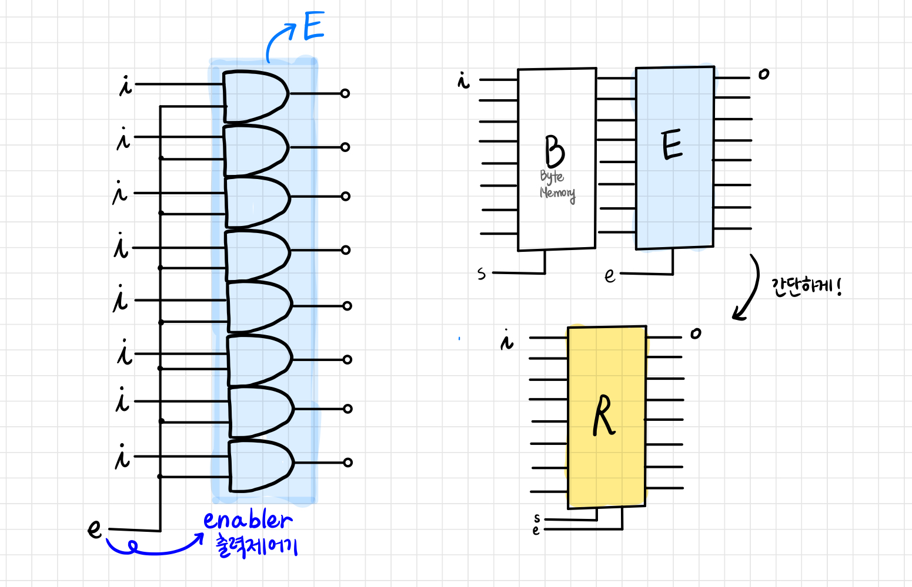
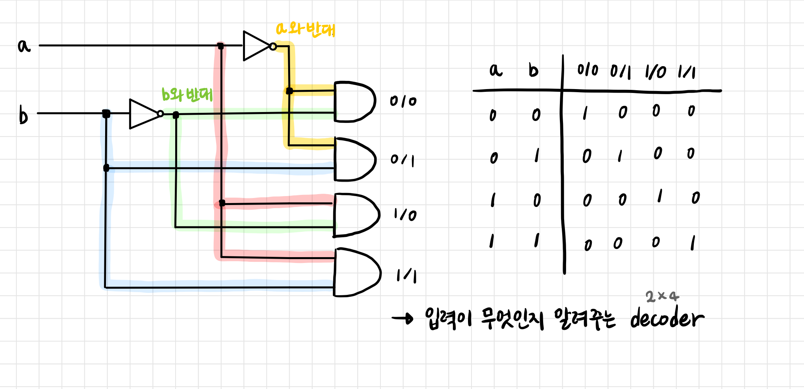

# 그래서 컴퓨터는 어떻게 동작하나요? Ch 11 ~ 16 \(47~82p\)

> 저자 : J.클라스 스코트 지음   
>  1월 5주차 기록 \(읽은 날짜 1월 29일-1월 30일\)

## 11. 0과 1

* `off`는 0, `on`은 1이라 하자.

## 12. 바이트

* `바이트(byte)` : 비트를 8개 묶은 단위
* 입력 비트 쌍의 순서는 유의미하다.

## 13. 바이트와 코드

* 초창기 컴퓨터 제조사들은 문자 언어 코드를 각자 만들다가 호환성을 위해 위원회를 구성하여 코드를 통일했다. 합의되지 않은 세부 사항도 많다.
* 위원회에서 제시한 기본 코드의 명칭은 `아스키코드`이다.
* 아스키코드는 영어권 사용자를 위해 알파벳과 다른 문자 기호를 표준화한 코드를 의미한다.

## 14. 레지스터

* 바이트 메모리와 출력 제어기를 합친 장치를 **레지스터**라고 한다.
* 레지스터에 새로운 상태를 저장하려면 기존 상태를 덮어씌운다. 따라서 레지스터에 남는 것은 가장 최근에 저장한 값이다.
* 레지스터는 데이터를 입력받고 유지할 수 있을 뿐 아니라 원할 때에만 출력을 내보낼 수 있다.

## 15. 버스

* 전선 8개는 겹선 1개로 표현한다.
* 전선 다발은 모든 컴퓨터에 공통으로 쓰이고 `버스(bus)`라고 부른다.
* 어떤 레지스터가 데이터를 출력하면 데이터는 엄청난 속도로 버스로 들어가서 버스에 연결된 모든 부품 입력 단자 앞에서 대기한다.
* 바이트 데이터를 출력하는 레지스터는 1개만 가능하지만, 바이트 데이터를 입력받는 레지스터는 동시에 2개 이상도 가능하다. 그러나 2개 이상의 레지스터가 동시에 각자 데이터를 출력하면 버스에서 데이터 간에 충돌이 생겨 모호한 데이터를 나타낼 수도 있다.
* 버스는 바이터 데이터가 이곳저곳 갈 수 있게 해주는 8개짜리 전선 다발이다.
* 바이트를 이동해도 출발지의 바이트 내용은 절대로 지워지지 않는다. 목적지 바이트에 있던 원본 바이트 패턴이 사라진다. 출발지 바이트 안에 있던 내용은 실은 이동한 게 아니라 복사된 것이다.

> 레지스터를 나타내는 4가지

## 16. 다중 입력 게이트와 다중 출력 게이트

* 입력을 `AND` 게이트로 대체하면 얼마든지 입력 개수를 늘릴 수 있다.
* 다중 입력 게이트도 모든 입력이 1인 경우에만 출력이 1이 된다.

### 디코더

* 디코더는 입력으로 받은 비트 상태에 해당하는 출력 하나만 1로 만들어 주는 장치

