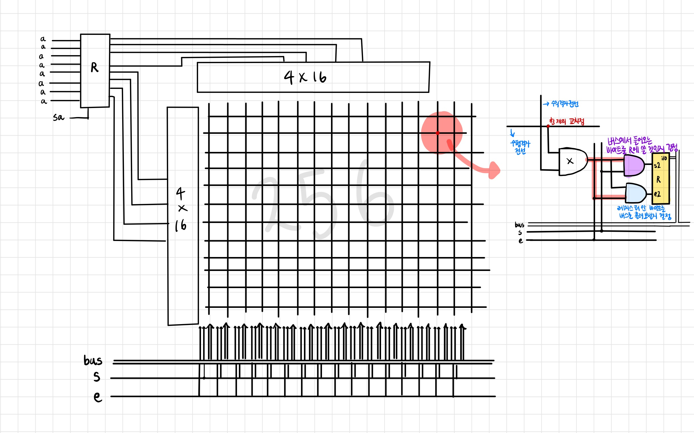
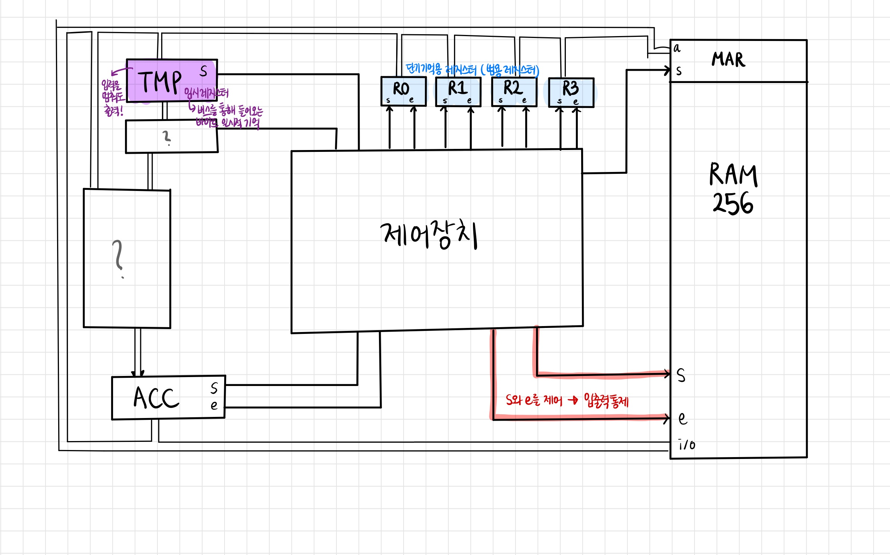
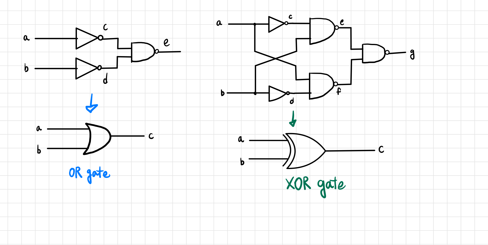

# Chapter 17 ~ 25 \(~114p\)

## 17. 컴퓨터의 절반, 램

> 주기억 장치의 구조

* 주기억 장치가 어떤 바이트에 접근하는 속도는 과거에 접근했던 주소에 영향을 받지 않는다. 이런 특성은 바이트 메모리에 무작위로 접근하고 싶을 때 유용하다. =&gt; 무작위 접근 메모리 \(random access memory, RAM\)
* 램 안에는 레지스터가 257개 들어있고 그 중 256개는 바이트를 저장하는 데 사용한다.
* 나머지 1개는 저장 장치에서 특정한 바이트의 위치를 가리키는 데 사용하고 이것을 메모리 주소 레지스터\(Memory Address Register\) 또는 `MAR` 이라고 한다.

### 커다란 용량의 램

* 더 큰 RAM을 만들려면 메모리 위치를 선택하는 MAR의 구조를 변경해야 한다.
* MAR의 레지스터 개수가 많을수록 더 많은 주소를 가리킬 수 있다.
* 버스는 한 번에 1바이트씩 실어 나를 수 있다.

## 18. 숫자 체계

* 이진수 체계는 컴퓨터 부품이 처리할 수 있는 능력에 자연스럽게 부합한다.

## 19. 컴퓨터의 내부 구조

* 컴퓨터 주소에는 어떤 팻말도 꼬리표도 붙어 있지 않지만 램 안의 바이트는 균일하고 규칙적으로 구획되어 있다. 컴퓨터 주소란 `MAR`에 `입력되는 숫자`이다. 이 주소로 램의 특정한 위치에 들어있는 바이트에 접근할 수 있다.

## 20. CPU

* 컴퓨터는 RAM와 CPU로 이루어진다.
* CPU\(central processing unit\)은 램에 들어 있는 바이트를 이용해서 어떤 일을 수행하고 수행한 결과를 램에 보내준다. 즉, 바이트를 처리하는 장치이다.
* CPU도 버스를 사용한다.
* CPU와 램 안에 들어 있는 레지스터는 컴퓨터가 작동하는 과정에서 바이트 데이터를 보내고 받는 장소이다. 레지스터는 버스로 출력을 보낼지 여부를 제어할 수 있고, 버스에 있는 바이트 데이터를 받아들일지 여부도 제어할 수 있다.

## 21. OR, XOR 게이트

> OR 게이트와 XOR 게이트

| a | b | NAND | AND | OR | XOR |
| :---: | :---: | :---: | :---: | :---: | :---: |
| 0 | 0 | 1 | 0 | 0 | 0 |
| 0 | 1 | 1 | 0 | 1 | 1 |
| 1 | 0 | 1 | 0 | 1 | 1 |
| 1 | 1 | 0 | 1 | 1 | 0 |

* 컴퓨터 안에 든 모든 부품은 사실 `NAND` 게이트만으로 만들 수 있다.
* 하지만 다른 게이트를 충분히 이용하면 훨씬 간단하고 효율적으로 컴퓨터를 만들 수 있다.

## 22. 바이트 연산

* 게이트는 비트 단위로 일을 한다.
* 반면에 램은 한번에 1바이트씩 저장하거나 저장된 값을 1바이트씩 꺼낼 수 있다.
* 레지스터 간의 데이터 복사는 보통 `바이트를 이동하는 행위`로 생각할 수 있다.

## 23. 비트 시프트 장치

* 비트 시프트 장치는 매우 쉽게 구현할 수 있다. 게이트가 하나도 필요하지 않다.

* 왼쪽 비트 시프트는 결국 2를 곱하는 연산이 된다.

## 24. 인버터

* NOT 게이트 장치는 다른 말로 `인버터`라고 부른다.
* 인버터는 다양한 연산에 사용된다.

## 25. AND 장치

* AND 장치는 바이트 단위로 된 입력 2개를 받아 개별적으로 AND 연산 8개를 수행한 후에 그 결과를 바이트 단위로 묶어 출력한다.
* 아스키코드의 모든 알파벳 대문자와 소문자는 세번째 비트의 부호만 다르게 구성되어 있다. 따라서 AND 장치를 이용하면 모든 알파벳 문자를 쉽게 대문자로 변환할 수 있다.
* `E` : 0100 0101 \| `e` : 0110 0101

