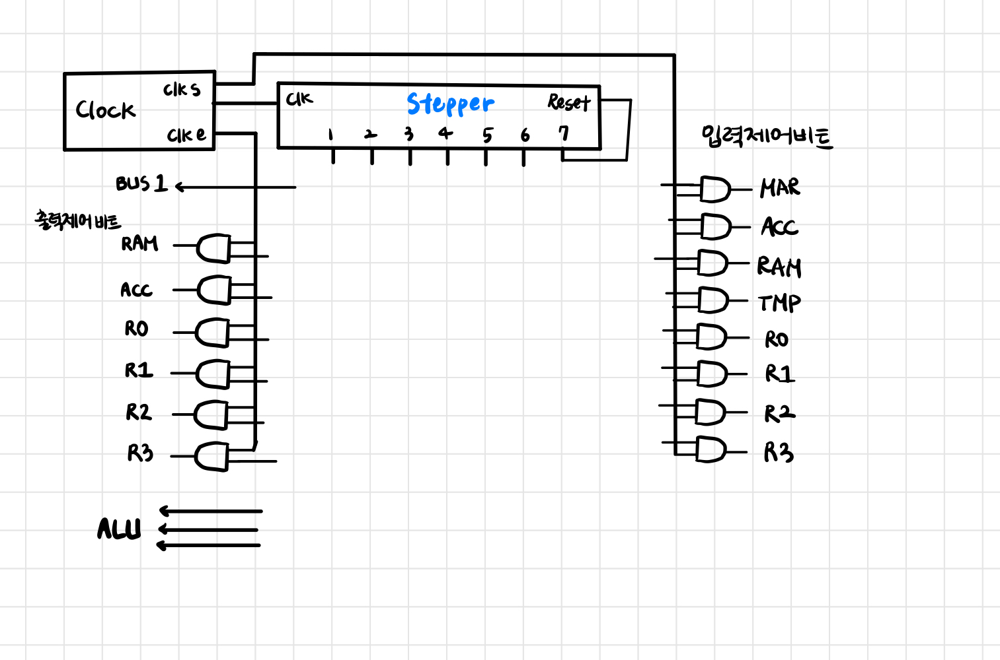

# Chapter 34 ~ 39 \(149p~172p\)

## 34.쓸모 있는 일하기

* 프로세서가 무언가 유용한 일을 하려면 여러 단계를 거쳐야 하고, 순차적으로 진행되어야 한다.
* 순차적으로 작업을 처리하려면 제어 장치 안에 부속품을 추가해야 한다.

## 35. 스테퍼

* 컴퓨터는 명령을 처리할 때 일련의 작은 작업으로 나누어 처리하는데, 각 작업은 엉키지 않고 단계적으로 올바른 순서로 진행되어야 한다.
* 이때 작업 단계를 지시하는 장치가 바로 `스테퍼`이다.
* 스테퍼는 입력 2개를 받는다.
  * 클록을 받아들이는 `clk` 단자
  * `reset` : 1이 되면 스테퍼가 1단계 상태로 돌아감
* 출력 단자는 7개로 7개의 비트 중 하나만 1이 되고 나머지는 0이 된다.

## 36. 자동으로 제어하기

* 스테퍼는 클록마다 연결되어 있는 여러 비트 메모리를 하나씩 번갈아가며 순서대로 켜지게 해준다.

* 입력 제어 비트를 1로 만드는 경우는 `clk s`가 1이 되는 시간 뿐이다.
* 컴퓨터가 어떤 일을 자동으로 수행하려면 스테퍼의 각 단계마다 맞는 제어 비트 몇 개를 현명하게 연결할 방법이 필요하다.

## 37. 단일 명령어 프로세서

## 38. 자동 주문 코드

* 특정 단순한 행동에 대응하는 1바이트 크기의 코드를 만들 수 있다.

## 39. 위대한 도약 1 : 프로그램 가능한 컴퓨터

* 여러 작업 중에 한 번에 단 1개의 작업만 선택하도록 만드는 방법 : 램에 로그하여 무엇을 할지 CPU에 말해주는 명령어 집합을 구현

### 명령어 집합이 동작하기 위해 충족되어야 하는 조건

1. CPU에 특수한 레지스터를 추가한다. -&gt; `명령어 레지스터, IR`
   * IR이 출력하는 일련의 비트는 CPU가 무엇을 해야 하는지 명령한다.
   * 버스로부터 입력을 받은 후 일련의 비트를 출력하고, 이것이 CPU 제어 장치 안에서 특정한 작업을 선택하고 처리하도록 명령
2. 명령어 주소 레지스터 추가 \(IAR\)
   * 입력과 출력이 버스와 연결되어 있고, IR에 로드할 다음 명령어가 들어 있는 램 주소를 저장할 때만 사용하는 레지스터
3. 제어 장치 내에 전선 몇 개 배선

제어 장치는 스테퍼를 이용해서 다음과 같은 일을 한다. 1. 램에서 현재 실행할 명령어 코드르 꺼내 IR에 넣어준다. 2. IAR에 들어 있는 주소에 **1을 더하여** 다음 명령어 실행을 준비한다. 3. IR에 들어 있는 현재 실행할 명령어 코드를 해석해서 그에 대응하는 동작을 수행한다.

프로그램이란, CPU가 호출해서 사용할 수 있도록 램의 특정 주소부터 순서대로 채워놓은 바이트 묶음을 의미한다. 명령어 세트를 실행할 수 있다는 것은 프로그램을 실행할 수 있다는 것이다.

### 명령어 가져오기

1. `IAR`에 들어 있는 주소\(램에서 가져와야 할 다음 명령어가 들어 있는 주소\)를 `MAR`에게 넘겨준다. 명령 사이클 동안 어느 시점에 IAR에 1을 더한다. op코드 000에 해당하는 ADD 명령을 실행하고 결과를 ACC에 넣어준다. bus 비트를 1로 만들면 ALU로 들어가는 두 번째 입력은 1이 된다. 이때 `clk s`가 1이 되는 시간 동안 ACC의 입력 제어 비트를 1로 설정하면, IAR에 들어 있던 주솟값과 1이 더해져서 결과가 ACC에 저장된다.
2. MAR로 선택한 램의 주소에 들어 있는 바이트 데이터를 버스로 출력하고 IR이 그 데이터를 입력받아 저장한다.
3. IAR을 갱신하는데 1을 더한 결과가 ACC에 있으므로 이 데이터를 IAR 안에 넣어준다.

